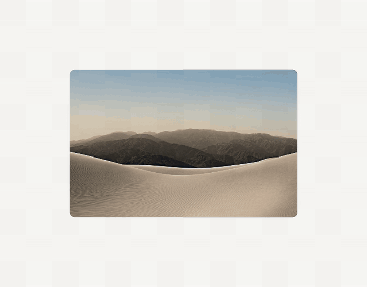

# Iphone Duo - page-flip animation

**Live preview → [iphone-duo-page-flip-animation.vercel.app](https://iphone-duo-page-flip-animation.vercel.app)**



An image viewer that turns your designs like the pages of a book, inspired by the
page-turn animation of the new iPhone Duo. Each design lies flat on the stage; its
right half lifts, swings over the hinge and lands on the left, revealing the next
design underneath. The same engine renders the animation frame by frame into a
video.

It is built from scratch in raw WebGL2 — no three.js, no framework, no build step.
The page is plain HTML, CSS and JavaScript that runs from any static host.

It was built with **Claude Opus 5** under the full direction of Nader Asaad — see
[How it was built](#how-it-was-built).

---

## Features

- **3D page flip** — a single sheet, reused for any number of designs.
- **The image never slides.** The artwork is pinned to screen space and the sheet
  moves underneath it, with motion blur and darkening that ramp across the turn.
- **Play, pause and scrub** — press play, click the artwork itself, or drag the
  scrubber to any point of the turn and carry on from there.
- **Your own artwork** — upload any number of images; they flip in the order you
  pick them.
- **Auto sizing** — the stage takes its shape from the artwork, so panoramic,
  square and portrait designs all keep proportionate margins. Fixed presets are
  there too.
- **Custom background** — a solid colour or an image. The contact shadow turns into
  a soft lift on dark backgrounds, and the sheet keeps its silhouette.
- **Rounded corners and sheet thickness**, both adjustable live.
- **Video export** — frame-perfect MP4 of the animation, identical every run, with
  an optional seamless loop.
- **One screen, no scrolling** — the settings sit beside the stage, so you see what
  a slider does while you drag it.
- **Embeddable** — the live page can be placed in an iframe on another site.

---

## Settings

### Advanced settings panel

| Setting | What it does | Range | Default |
|---|---|---|---|
| **Background** | Stage colour swatch, or **Upload image** for an image background | — | `#f6f6f3` |
| **Duration** | Length of one page turn | 400 – 3000 ms | 3000 ms |
| **Max blur** | Strongest motion blur on the turning sheet | 0 – 160 px | 150 px |
| **Lens** | Camera distance — lower values give stronger perspective | 200 – 2000 | 560 |
| **Darken** | How dark the sheet gets as it turns | 0 – 300 % | 250 % |
| **Sheet thickness** | Thickness of the page edge | 0 – 60 | 20 |
| **Scale** | How much of the stage width the artwork covers | 30 – 95 % | 62 % |
| **Corner radius** | Roundness of the card and the page | 0 – 80 | 40 |
| **Crease shadow** | Shadow along the spine while the page stands up | 0 – 100 % | 0 % |

**Reset** returns to the placeholder designs.

### Bottom bar

| Control | What it does |
|---|---|
| **Artwork size** | **Auto (from the artwork)** by default, or a fixed preset: 3240 × 1350 (2.40:1), 2160 × 1350 (1.60:1), 1920 × 1080 (1.78:1) |
| **Upload** | Load your own designs |
| **Play / pause** | Start or stop the turn — clicking the artwork does the same |
| **Scrubber** | Move the page by hand to any point of the turn |

Below the bar, the readouts show the current **Angle**, **Progress**, **Face**
(front or back of the sheet), **Design** number and **Stage** ratio.

If the loaded designs don't share one aspect ratio, a banner says so and the first
design's ratio is used.

---

## Run it locally

The page needs to be served over http to load the default artwork from `assets/`:

```bash
python -m http.server
```

Then open <http://localhost:8000/page-flip.html>.

Opened straight from the file system (double-click), the page still works but starts
on placeholder designs — upload your own with **Upload**.

---

## Export a video

`render.py` drives the engine frame by frame and encodes the result with ffmpeg, so
every frame lands exactly where it should — no dropped frames, and the same output
every run.

**Requirements:** Python 3, [ffmpeg](https://ffmpeg.org) on your `PATH`, and Playwright:

```bash
pip install playwright
playwright install chromium
```

**Examples:**

```bash
# the two default designs, looping back to the first
python render.py assets/day.png assets/night.png -o book.mp4 --loop

# your own designs, faster turns, on a dark background
python render.py design1.jpg design2.jpg design3.jpg --flip 2000 --set bgcol=#101014

# an image as the background
python render.py design1.jpg design2.jpg --set bgimage=backdrop.jpg
```

| Option | Meaning | Default |
|---|---|---|
| `designs` | Image files, in flip order | — |
| `-o`, `--out` | Output file | `page-flip.mp4` |
| `--size WxH` | Output resolution. Omitted: an Auto stage uses the artwork's own width; a preset renders at 2160 × 1350 | stage decides |
| `--fps` | Frames per second | 30 |
| `--flip` | Milliseconds per page turn | 3000 |
| `--hold` | Milliseconds resting on each design | 700 |
| `--loop` | Turn through every design and back to the first, so the video loops seamlessly | off |
| `--set key=value` | Override any setting — repeatable | — |
| `--keep-frames` | Keep the rendered PNG frames | off |

**Keys for `--set`:** `blur`, `eye` (lens), `dark`, `thick`, `fit` (scale), `rad`
(corner radius), `crease`, `size` (`auto`, or `0`, `1`, `2` for the presets),
`bgcol` (a hex colour) and `bgimage` (an image file).

---

## Regression check

`regression.py` renders the engine with its effects switched off and checks that the
turning sheet is pixel-exact against the flat artwork, on light, mid, dark and image
backgrounds and on a dark test artwork. It also stops immediately if any script fails
to parse or the page logs an error while loading.

```bash
pip install playwright numpy pillow
python regression.py
```

---

## Project structure

```
page-flip.html        the page: markup and the control panel
src/constants.js      timing curve, size presets, grounding model
src/shaders.js        all GLSL programs
src/gl.js             WebGL context, programs, geometry
src/textures.js       artwork upload
src/stage.js          background and everything derived from it
src/engine.js         state, drawing, the animation clock
src/controls.js       the settings panel
src/render-api.js     hooks used by render.py and regression.py
src/style.css         styles
src/assets.js         the artwork the page opens with
assets/               default artwork (day.png, night.png)
render.py             video export
regression.py         the regression check
vercel.json           static hosting on Vercel
HANDOFF.md            detailed technical notes
```

The site is deployed on Vercel as static files, with `/` serving `page-flip.html`.

---

## How it was built

This project was built using **[Claude Opus 5](https://www.anthropic.com/claude)**,
Anthropic's AI model, under the full direction of **Nader Asaad**.

Nader directed the work at every step: the iPhone Duo reference, the look and timing
of the turn, the interface mockup, the default artwork and settings, and what the
project should and should not do. Each change was reviewed by Nader — including
spotting defects by eye and sending them back — and Nader decided what shipped.
Claude Opus 5 implemented that direction in code and tested each change by rendering
and measuring frames.

---

## Credits

Created by **Nader Asaad** —
[Instagram](https://www.instagram.com/9na4) ·
[LinkedIn](https://www.linkedin.com/in/9na4/) ·
[Behance](https://www.behance.net/9na4) ·
[GitHub](https://github.com/9nr) ·
[WhatsApp](https://wa.me/9na4)

Icons: [Bootstrap Icons](https://icons.getbootstrap.com), MIT License.

iPhone is a trademark of Apple Inc. This project is an independent design study and is
not affiliated with or endorsed by Apple.
